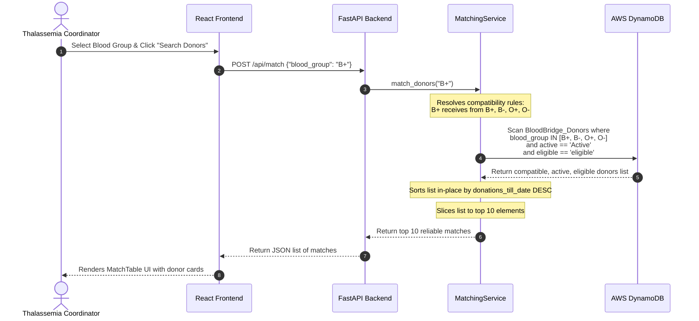
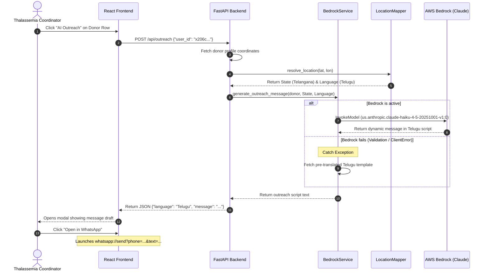
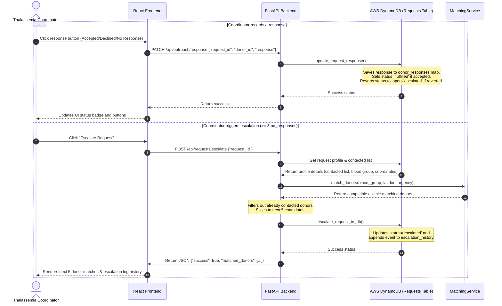

# BloodBridge AI - System Architecture Document

This document outlines the detailed system architecture, logical layers, data flow patterns, and design patterns implemented in the **BloodBridge AI** application.


---

## 🏗️ 1. High-Level Architectural Flow

BloodBridge AI is built on a modular full-stack architecture, utilizing React on the frontend, FastAPI on the backend, and AWS cloud resources for scalable storage and AI inference.

```mermaid
graph TD
    User([Thalassemia Coordinator]) -->|Interacts with UI| Frontend[React + Tailwind CSS v4 Frontend]
    
    subgraph Frontend Client App (Vite Dev Server)
        Frontend -->|Axios HTTP Requests| API_Client[api.js Client]
    end

    API_Client -->|REST API calls over HTTP| Backend[FastAPI Server]

    subgraph FastAPI Backend App (Uvicorn Server)
        Backend -->|Matching & Requests| Match_Route[/api/match & /api/requests/*]
        Backend -->|Outreach & Responses| Outreach_Route[/api/outreach & /api/outreach/response]
        Backend -->|Analytics Stats| Stats_Route[/api/stats]

        Match_Route --> Matching_Service[MatchingService]
        Outreach_Route --> Bedrock_Service[BedrockService]
        Stats_Route --> DB_Service[DynamoDBService]

        Matching_Service --> Compatibility_Util[compatibility.py Matrix]
        Matching_Service --> DB_Service
        Bedrock_Service --> DB_Service
        
        Bedrock_Service --> Location_Mapper[location_mapper.py Offline Geocoder]
        Location_Mapper --> Location_Map[(location_map.json State Boundaries)]
    end

    subgraph AWS Cloud Resources (us-east-1)
        DB_Service -->|Write/Scan Donors| Donors_Table[(AWS DynamoDB Table: BloodBridge_Donors)]
        DB_Service -->|Write/Scan Requests| Requests_Table[(AWS DynamoDB Table: BloodBridge_Requests)]
        Bedrock_Service -->|InvokeModel API| Bedrock_Claude[(AWS Bedrock: Claude Haiku 4.5)]
    end

    subgraph Resilient Offline Fallbacks (Local System)
        DB_Service -.->|Mock Database Fallback| CSV_Mock[(In-Memory CSV Reader & Mock Lists)]
        Bedrock_Service -.->|Mock Outreach Fallback| Local_Templates[Native Language Templates]
    end
```

---

## 🎨 2. Logical Layer Breakdown

### A. Presentation Layer (Vite + React.js + Tailwind CSS v4)
* **Branding & Visuals**: Premium dark-mode interface utilizing HSL tailored red gradients and navy blue overlays, maintaining high visual hierarchy and responsive grid layouts.
* **Views**:
  * **Coordinator Dashboard**: Interactive interface allowing coordinators to select an active request context, locking the search parameters (blood group, urgency, coordinates) to prevent errors. Includes a match table with action triggers to update outreach statuses (`Accepted`, `Declined`, `No Response`) and trigger request escalations.
  * **Admin Insights**: Real-time analytics view compiling total registration numbers, eligibility rates, rendering distributions via modular SVG charts using **Recharts**, and a Requests Log table for listing and tracking all requests.
* **API Client (`api.js`)**: Encapsulates matching, outreach, request creation, requests list, response status updates, and escalation endpoints.

### B. Application Server Layer (FastAPI + Uvicorn)
* **Asynchronous Design**: Built on FastAPI's ASGI implementation to process multiple API requests concurrently with minimal memory usage.
* **Endpoints**:
  * `POST /api/match`: Takes recipient blood type, returns compatible donors.
  * `POST /api/outreach`: Takes donor ID, returns language and custom WhatsApp text.
  * `GET /api/stats`: Returns database aggregations for charts.
  * `POST /api/requests/create`: Creates a new patient blood request.
  * `GET /api/requests`: Retrieves all logged requests.
  * `PATCH /api/outreach/response`: Records a donor response (fulfilled if accepted, reverts back to open/escalated if reverted).
  * `POST /api/requests/escalate`: Excludes contacted donors, gets next 5 matches, logs history, sets status to escalated.
* **Services Layer**:
  * **Matching Service**: Translates blood group compatibility matrices (`compatibility.py`) and queries database records. Also handles urgency and soft-eligibility.
  * **Bedrock Service**: Initializes the Boto3 Bedrock Runtime client and executes inference prompts.
  * **DynamoDB Service**: Coordinates database connections, scans, updates request responses, and writes escalation history logs.

### C. Storage & Database Layer (AWS DynamoDB)
* **Multi-Table Model**:
  - `BloodBridge_Donors`: Hashed by `user_id` partition key, storing donor registration information, eligibility statuses, locations, and historical statistics.
  - `BloodBridge_Requests`: Hashed by `request_id` partition key, storing patient details, urgency, coordinates, contacted donor responses (`donor_responses` map), and escalation metrics (`escalation_history` list).
* **Batch Importer**: The `load_data.py` script validates inputs and leverages the DynamoDB `batch_writer()` to upload records in chunks of 25 to optimize write capacities.
* **Projected Scans**: Queries only read specific projected attributes when fetching analytics statistics to optimize performance and reduce AWS read unit costs.

### D. Geolocation & Spatial Layer
* **Offline Centroid Mapper**: Employs `location_mapper.py` to calculate Euclidean distances between donor coordinates and Indian state reference centroids.
* **State Mapping**: Determines the closest Indian State boundary and maps it to the region's native language and script:
  * Telangana / Andhra Pradesh $\rightarrow$ Telugu script
  * Karnataka $\rightarrow$ Kannada script
  * Tamil Nadu $\rightarrow$ Tamil script
  * Maharashtra $\rightarrow$ Marathi script
  * Others $\rightarrow$ Hindi / English script

---

## 🔄 3. Core Data Flow Pipelines

### A. Donor Matching Pipeline


### B. AI Outreach Pipeline


### C. Closed-Loop Response & Escalation Pipeline


---

## 🛡️ 4. Key Design Considerations

### 1. High Offline Resiliency (Mock Mode)
To ensure the application remains 100% operational during offline demonstrations, hackathon evaluations, or instances where AWS credentials are missing, we built a layered fallback design:
* **Database Fallback**: If connection to AWS DynamoDB fails during startup, the `DynamoDBService` catches the exception and toggles `self.use_mock = True`. It parses `Dataset.csv` locally, loads records into memory, and performs all filters and statistics calculations in-memory.
* **AI Fallback**: If AWS Bedrock runtime throws a ValidationException or ClientError, the backend catches the error and pulls pre-translated, script-accurate templates for the resolved language, serving the coordinator without a service crash.

### 2. Cost and Performance Optimization
* **AWS Bedrock Inference Profile**: Standard on-demand invocations are not supported on the base model ID `anthropic.claude-haiku-4-5-20251001-v1:0`. To run on-demand calls, the service routes requests via the cross-region inference profile `us.anthropic.claude-haiku-4-5-20251001-v1:0`, which optimizes latency and cost.
* **DynamoDB Projection**: Using projected scans prevents fetching unnecessary large attributes like latitude/longitude or donation ratios during admin dashboard renders, which minimizes AWS read capacity unit (RCU) consumption.
