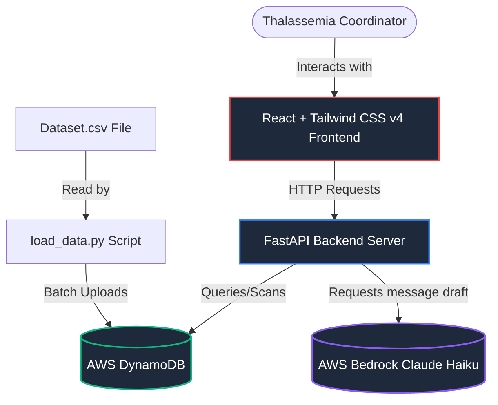

# BloodBridge AI - Build Documentation

Welcome to the build documentation for **BloodBridge AI**, a donor matching and outreach platform built for the Blood Warriors Thalassemia Donor Matching Hackathon.

---

## 🏗 System Architecture Overview

BloodBridge AI is a full-stack web application designed to help thalassemia coordinators search for compatible blood donors, view real-time registry analytics, and generate regional-language outreach messages.

### Architecture Flow


1. **Frontend**: A React.js application styled with Tailwind CSS (v4) using modern layouts (cards, sidebars, charts).
2. **Backend**: A FastAPI REST server routing matching requests, generating outreach templates, and calculating statistics.
3. **Database Layer**: AWS DynamoDB hosting the `BloodBridge_Donors` table. It features an automatic offline fallback mode that loads `Dataset.csv` into memory if AWS credentials or networks are unavailable.
4. **AI Outreach**: A service combining an offline Indian location-to-language mapper (`location_mapper.py`) with AWS Bedrock (**Claude Haiku** via Cross-Region Inference Profile `us.anthropic.claude-haiku-4-5-20251001-v1:0`) to generate localized outreach text.

---

## 🛠 Technology Stack

### Backend
* **FastAPI**: Asynchronous web framework for APIs.
* **Uvicorn**: ASGI web server implementation.
* **Boto3**: AWS SDK for Python (DynamoDB & Bedrock).
* **Python-dotenv**: Environment variable management.

### Frontend
* **React.js (Vite)**: Fast build tool and development server.
* **Tailwind CSS (v4)**: Sleek utility-first CSS styling.
* **Recharts**: Modular SVG chart rendering.
* **Axios**: HTTP client for API requests.

---

## 📂 Project Structure & Created Files

Here is the directory structure highlighting all core files in the project:

```text
Pulselink-Hackethon/
│
├── backend/                        # FastAPI Backend Code
│   ├── routes/                     # API Route Handlers
│   │   ├── match.py                # Matching endpoint (/api/match)
│   │   ├── outreach.py             # AI Outreach endpoint (/api/outreach)
│   │   └── stats.py                # Analytics stats endpoint (/api/stats)
│   │
│   ├── services/                   # Database & LLM Integrations
│   │   ├── bedrock_service.py      # AWS Bedrock Claude client & local templates
│   │   ├── dynamodb_service.py     # DynamoDB connection, mock fallback, and queries
│   │   └── matching_service.py     # Compatibility logic & donation count sorter
│   │
│   ├── utils/                      # Helper Modules
│   │   ├── compatibility.py        # Blood compatibility rules matrix
│   │   ├── location_map.json       # Indian latitude/longitude state boundaries mapping
│   │   └── location_mapper.py      # Offline latitude/longitude reverse geocoding
│   │
│   ├── .env                        # Local configurations & AWS credentials
│   ├── app.py                      # Main entrypoint (FastAPI app & Middleware)
│   └── requirements.txt            # Python dependencies
│
├── frontend/                       # React Frontend Code
│   ├── src/
│   │   ├── components/             # Reusable UI Blocks
│   │   │   ├── MatchTable.jsx      # Donor results list
│   │   │   ├── OutreachModal.jsx   # AI WhatsApp message composer
│   │   │   └── StatsCards.jsx      # Dashboard metrics cards
│   │   │
│   │   ├── pages/                  # Top-level Page Views
│   │   │   ├── Dashboard.jsx       # Coordinator Search & Matches UI
│   │   │   └── Admin.jsx           # Analytics charts and statistics
│   │   │
│   │   ├── services/
│   │   │   └── api.js              # Axios API clients
│   │   │
│   │   ├── App.css                 # Custom styles
│   │   ├── App.jsx                 # Core routing/nav wrapper
│   │   ├── index.css               # Tailwind directives & CSS config
│   │   └── main.jsx                # Application root mounting
│   │
│   ├── package.json                # Frontend dependencies & scripts
│   └── vite.config.js              # Vite configurations
│
├── Dataset.csv                     # Raw donor database dataset
├── load_data.py                    # CSV validation & DynamoDB import script
└── location_map.json               # Offline location database source
```

### Reference File Links:
* Main Backend Application: [app.py](file:///c:/Users/wagge/OneDrive/Desktop/Pulselink-Hackethon/backend/app.py)
* DynamoDB Service: [dynamodb_service.py](file:///c:/Users/wagge/OneDrive/Desktop/Pulselink-Hackethon/backend/services/dynamodb_service.py)
* Data Loader: [load_data.py](file:///c:/Users/wagge/OneDrive/Desktop/Pulselink-Hackethon/load_data.py)
* Main Frontend Application: [App.jsx](file:///c:/Users/wagge/OneDrive/Desktop/Pulselink-Hackethon/frontend/src/App.jsx)
* API Clients: [api.js](file:///c:/Users/wagge/OneDrive/Desktop/Pulselink-Hackethon/frontend/src/services/api.js)

---

## ⚙️ Environment Configuration

Both the frontend and backend are configured using the root `.env` file since the server starts from the workspace root.

Create/modify the `.env` file in the project root:
```env
AWS_ACCESS_KEY_ID=AKIA...
AWS_SECRET_ACCESS_KEY=...
AWS_DEFAULT_REGION=us-east-1
DYNAMODB_TABLE_NAME=BloodBridge_Donors
BEDROCK_MODEL_ID=us.anthropic.claude-haiku-4-5-20251001-v1:0
PORT=8000
HOST=0.0.0.0
```

---

## 💾 How to Load Data into DynamoDB

The [load_data.py](file:///c:/Users/wagge/OneDrive/Desktop/Pulselink-Hackethon/load_data.py) script parses `Dataset.csv`, validates fields, and imports them in batches of 25.

1. Ensure your root [.env](file:///c:/Users/wagge/OneDrive/Desktop/Pulselink-Hackethon/.env) contains valid AWS credentials and configuration variables.
2. Navigate to the workspace root directory and execute the import script:
   ```powershell
   .\venv\Scripts\python load_data.py
   ```
3. Logs will print every 500 records. Invalid rows will be skipped and written to `import_errors.log`.

---

## 🏃 How to Run the Project

### Running the Backend
From the root workspace directory, run:
```powershell
.\venv\Scripts\python -m uvicorn backend.app:app --host 127.0.0.1 --port 8000 --reload
```
The API documentation will be available at [http://127.0.0.1:8000/docs](http://127.0.0.1:8000/docs).

### Running the Frontend
From the `frontend/` directory, run:
```powershell
cd frontend
npm run dev
```
Open [http://localhost:5173](http://localhost:5173) in your web browser.

---

## 🔌 API Endpoints Specifications

### 1. Smart Donor Matching
Finds compatible active eligible donors sorted by total donation count descending.

* **Path**: `/api/match`
* **Method**: `POST`
* **Request Header**: `Content-Type: application/json`
* **Request Body**:
  ```json
  {
    "blood_group": "A+"
  }
  ```
* **Response Body**:
  ```json
  {
    "matches": [
      {
        "user_id": "\\x206ce1c32d20ccab7cc790a6e08a07034404ba5f3d81ba9e86d8addd23fce6f8",
        "role": "Bridge Donor",
        "blood_group": "O+",
        "gender": "Male",
        "latitude": 17.3922792,
        "longitude": 78.4602749,
        "last_donation_date": "2025-04-19",
        "next_eligible_date": "2025-07-18",
        "donations_till_date": 10,
        "eligibility_status": "eligible",
        "donor_type": "Regular Donor",
        "user_donation_active_status": "Active",
        "calls_to_donations_ratio": 1.00
      }
    ]
  }
  ```

### 2. AI Outreach Assistant
Maps coordinates to local Indian language and drafts a regionalized outreach script.

* **Path**: `/api/outreach`
* **Method**: `POST`
* **Request Header**: `Content-Type: application/json`
* **Request Body**:
  ```json
  {
    "user_id": "\\x206ce1c32d20ccab7cc790a6e08a07034404ba5f3d81ba9e86d8addd23fce6f8"
  }
  ```
* **Response Body**:
  ```json
  {
    "language": "Telugu",
    "message": "నమస్కారం! 🙏\n\n*Blood Warriors* సంస్థ నుండి ఒక ప్రేమపూర్వక విజ్ఞప్తి - మీ O+ రక్తం ఒక థాలసీమియా బాధితమైన చిన్న బిడ్డకు జీవం ఇవ్వగలదు. మీ రక్తం దానం చేయడానికి సిద్ధంగా ఉంటే దయచేసి ఈ సందేశానికి రిప్లై ఇవ్వండి. ధన్యవాదాలు! 🤝"
  }
  ```

### 3. Admin Analytics Dashboard
Fetches aggregate distributions for admin dashboard charts.

* **Path**: `/api/stats`
* **Method**: `GET`
* **Response Body**:
  ```json
  {
    "total_donors": 4972,
    "eligible_donors": 4405,
    "blood_group_distribution": {
      "A+": 877,
      "O+": 1959,
      "B+": 1474,
      "AB+": 359,
      "O-": 120,
      "A-": 53,
      "AB-": 36,
      "B-": 94
    },
    "donor_type_breakdown": {
      "Regular Donor": 1993,
      "One-Time Donor": 2291,
      "Other": 688
    }
  }
  ```
